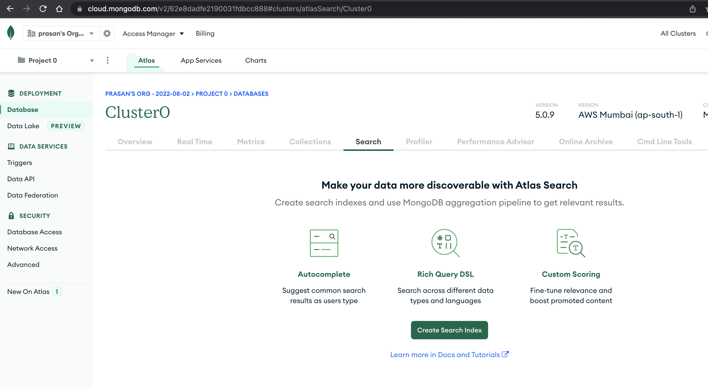
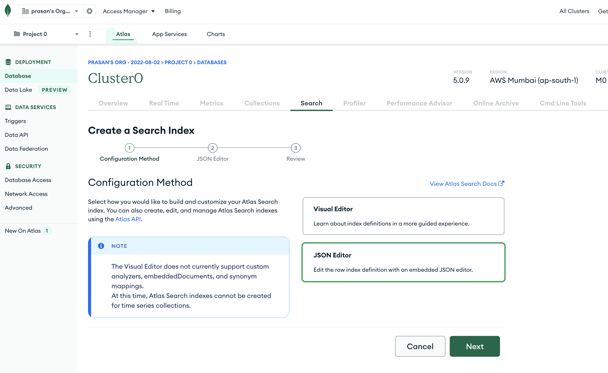
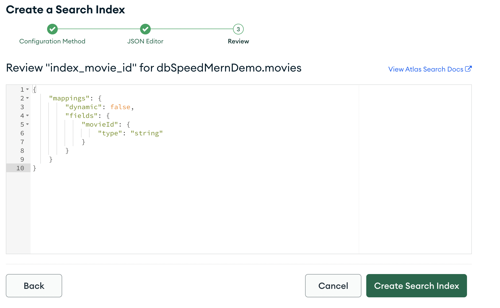
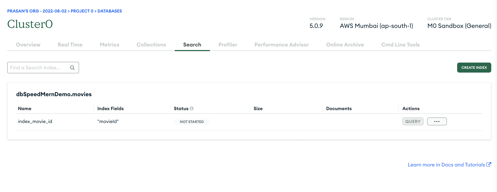

## Indexes

Create following indexes in MongoDB Atlas

### Index 1 (For text search)

- index name: **index_movies_quick_text_search**

```json
{
  "mappings": {
    "dynamic": false,
    "fields": {
      "statusCode": {
        "type": "number"
      },
      "title": {
        "type": "string"
      },
      "tagline": {
        "type": "string"
      },
      "plot": {
        "type": "string"
      }
    }
  }
}
```

### Index 2 (basic form search)

- index name: **index_movies_basic_search**

```json
{
  "mappings": {
    "dynamic": false,
    "fields": {
      "statusCode": {
        "type": "number"
      },
      "imdbRating": {
        "type": "number"
      },
      "countries": {
        "type": "string"
      },
      "year": {
        "type": "document",
        "dynamic": false,
        "fields": {
          "low": {
            "type": "number"
          }
        }
      },
      "title": {
        "type": "string"
      }
    }
  }
}
```

### Index 3 (master categories for dropdown values)

- index name: **index_master_categories**

```json
{
  "mappings": {
    "dynamic": false,
    "fields": {
      "statusCode": {
        "type": "number"
      },
      "category": {
        "type": "string"
      }
    }
  }
}
```

## Screenshots

Steps to create index in Atlas

- Navigate to "Search" tab -> click on "Create Search Index"
  

- Choose "JSON editor"
  

- Choose collection, specify index name & index json configuration
  

- Review & create
  

- Verify status
  

## References

- [MongoDB Docs](https://www.mongodb.com/docs/atlas/atlas-search/create-index/#create-an-fts-index-using-the-service-ui)
  - [video](https://youtu.be/o2ss2LJNZVE)
